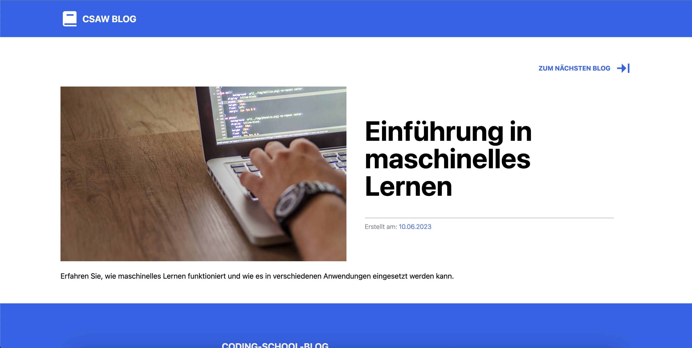
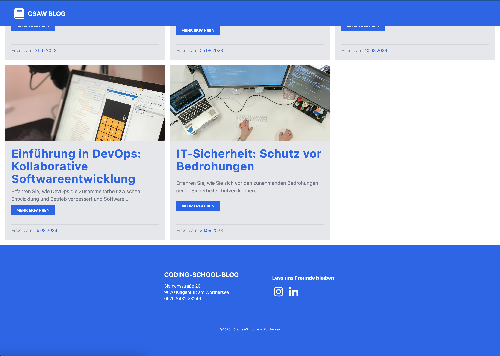

## Blogfeed CSAW mit ReactJS, TypeScript & Tailwind CSS

Entwickeln Sie eine Blogfeed-Anwendung mit ReactJS, TypeScript und Tailwind CSS. Die Anwendung soll folgende Anforderungen erfüllen:

1.  Verwenden Sie React Router, um die Seiten der Anwendung zu verwalten.
2.  Erstellen Sie eine Startseite namens "Home" (Pfad: / ), auf der alle Blogposts angezeigt werden.
3.  Jeder Blogpost sollte als Vorschau auf der Startseite angezeigt werden. Die Vorschau sollte den Titel des Blogs, das Datum und eine Kurzbeschreibung enthalten (hint: Dynamic Route - React Router)
4.  Wenn ein Benutzer auf einen Blogpost klickt, sollte er zur Detailseite des entsprechenden Blogs weitergeleitet werden.
5.  Die Detailseite eines Blogs sollte den vollständigen Inhalt des Blogs anzeigen, einschließlich des Titels, des Datums und des Textes.
6.  Auf der Detailseite sollte es eine Navigation geben, um zum vorherigen bzw. nächsten Blogpost zu wechseln.

    - Wenn der Benutzer auf den "Nächster Blog" Button klickt, sollte er zum nächsten Blogpost in der Liste weitergeleitet werden.
    - Wenn der Benutzer auf den "Vorheriger Blog" Button klickt, sollte er zum vorherigen Blogpost in der Liste weitergeleitet werden.
    - Der "Vorheriger Blog" Button sollte nicht angezeigt werden, wenn der Benutzer bereits den ersten Blogpost in der Liste angezeigt bekommt.
    - Der "Nächster Blog" Button sollte nicht angezeigt werden, wenn der Benutzer bereits den letzten Blogpost in der Liste angezeigt bekommt.
    - Der Erste Blog sollte wie im Screenshot gezeigt die volle Breite des Bildschirms einnehmen, alle anderen Blogs folgen danach im normalen (kleinen) Format.
    - Der Header sollte immer mitfahren sobald man scrollt.
    - Das Design soll 1 zu 1 wie im Screenshot gezeigt sein.
    - Die Blogdaten findet ihr in der beigelegten Datei (daten.ts).
    - Alle Schritte sollten mit GIT commited werden, für eine nachvollziehbare Git-History
    - Das Projekt sollte zu 100% Responsive sein

    Verwenden Sie ReactJS für die Komponentenerstellung, TypeScript für die Typsicherheit und Tailwind CSS für das Styling der Anwendung.

### Hinweise:

Sie können fiktive Daten für die Blogposts verwenden oder eine API verwenden, um die Daten dynamisch zu laden.
Stellen Sie sicher, dass Sie die erforderlichen Abhängigkeiten in Ihrer Projektumgebung installiert haben, einschließlich React Router, TypeScript, React und Tailwind CSS.
Vergessen Sie nicht, die erforderlichen Routen in der React Router-Konfiguration zu definieren.
Achten Sie darauf, dass die Blogposts in der richtigen Reihenfolge angezeigt werden und die Navigation zwischen den Posts korrekt funktioniert.
Testen Sie die Anwendung gründlich, um sicherzustellen, dass alle Anforderungen erfüllt sind und das Verhalten wie erwartet funktioniert.
Viel Erfolg beim Implementieren der Blogfeed-Anwendung mit ReactJS, TypeScript und Tailwind CSS!

## 

---

## 

---

## 

---

